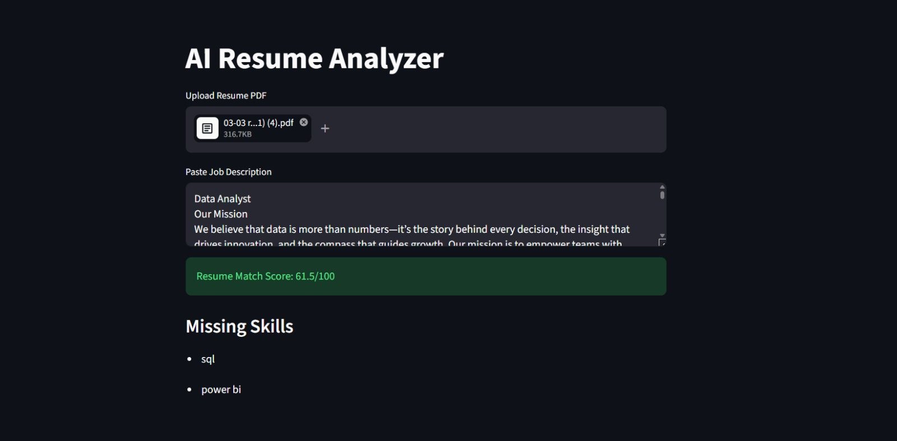

# 🤖 AI Resume Analyzer

An AI-powered resume analyzer that matches your resume against a job description 
and gives you a match score with missing skills.

🚀 **Live App:** [Click here to try it](https://ai-resume-analyzer-6cg5kzrnmjzyjt8pcwsgvc.streamlit.app/)

## 💡 How It Works

1. Upload your resume as a PDF
2. Paste the job description
3. Get an instant match score out of 100
4. See exactly which skills are missing

## ✨ Features

- PDF resume parsing
- Job description keyword analysis
- Resume match score (out of 100)
- Missing skills detection
- Clean interactive UI

## 🛠️ Technologies

- Python
- Streamlit
- NLP / keyword extraction

## 👤 Author

**Pranavi Reddy**  
[GitHub](https://github.com/pranavireddyreddy9-ux)
